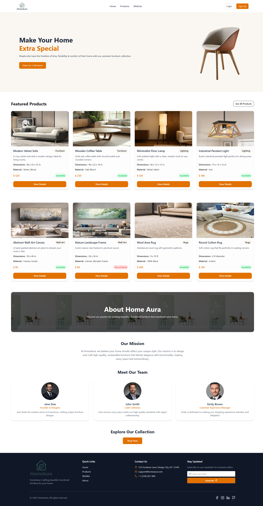

# 🏠 HomeAura

**HomeAura** is a modern and responsive Home Decor & Furniture website built with **React** and **Tailwind CSS**.  
It showcases elegant furniture collections, product details, and team information with a clean and user-friendly design.

---

## 🌟 Features

✅ Fully responsive and modern UI  
✅ Product listing with category tags  
✅ Product details with availability status  
✅ "Add to Wishlist" feature using LocalStorage  
✅ About section with mission statement and team info  
✅ Newsletter subscription form  
✅ Elegant footer with quick links and contact info

---

## 🧩 Technologies Used

- ⚛️ **React JS**
- 💨 **Tailwind CSS**
- 🔄 **React Router DOM**
- 💾 **LocalStorage (for Wishlist)**
- 💅 **SweetAlert2** (for alerts and popups)
- 🧱 **Vite** (for fast development and build)

---

## 📂 Folder Structure

HomeAura/
├── public/
├── src/
│ ├── assets/
│ ├── components/
│ ├── pages/
│ ├── router/
│ ├── utilities/
│ ├── App.jsx
│ └── main.jsx
├── package.json
└── vite.config.js

yaml
Copy code

---

## 🚀 Getting Started

### 1️⃣ Clone the Repository
git clone https://github.com/obaidullah-miazi-dev/HomeAura.git
2️⃣ Navigate to Project Folder
bash
Copy code
cd HomeAura
3️⃣ Install Dependencies
bash
Copy code
npm install
4️⃣ Run the Development Server

Copy code
npm run dev
Then open your browser and visit 👉 http://localhost:5173/

🖼️ Preview

💡 Future Improvements
Add user authentication (Login & Signup functionality)

Implement real backend (Node.js + MongoDB)

Add product filtering and sorting

Create admin dashboard for managing products

🧑‍💻 Developer
👋 Developed by Obaidullah Miazi
📧 Email: obaidullahmiazi.dev@gmail.com
🔗 LinkedIn: http://www.linkedin.com/in/obaidullah-miazi

🪄 License
This project is open source and available under the MIT License.

⭐ If you like this project, don’t forget to give it a star on GitHub!